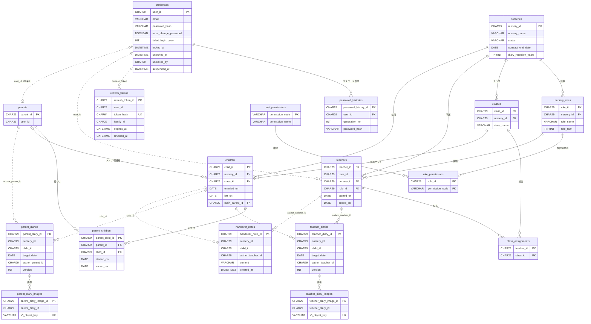

# ER図（公開版）

- 作成日：2026-10-07
- 元にしたテーブル定義：table-design.md（修正版）
- 実線：外部キーあり（同じモジュールの中の、データが少ないテーブル）
- 点線：外部キーなし。①モジュールをまたぐ関係（論点N）、②大量データ・書き込みが多いテーブル（連絡帳の画像、Refresh Token。P2）。IDで参照し、集約とアプリで整合性を守る
- 監査項目（created_at など）と論理削除の列は省略

## 全体

## モジュールごとの見方

| モジュール（スキーマ） | テーブル | 集約（2-8-2） |
|---|---|---|
| auth | credentials、password_histories | UserAccount |
| auth | refresh_tokens | RefreshToken |
| nursery | nurseries | Nursery |
| nursery | nursery_roles、role_permissions（mst_permissions は権限マスタ） | NurseryRole |
| nursery | teachers、class_assignments | Teacher |
| nursery | classes | ClassRoom |
| nursery | children、parent_children | Child |
| nursery | parents | Parent |
| diary | teacher_diaries、teacher_diary_images | TeacherDiary |
| diary | parent_diaries、parent_diary_images | ParentDiary |
| diary | handover_notes | HandoverNote（公開版は表示だけ） |
